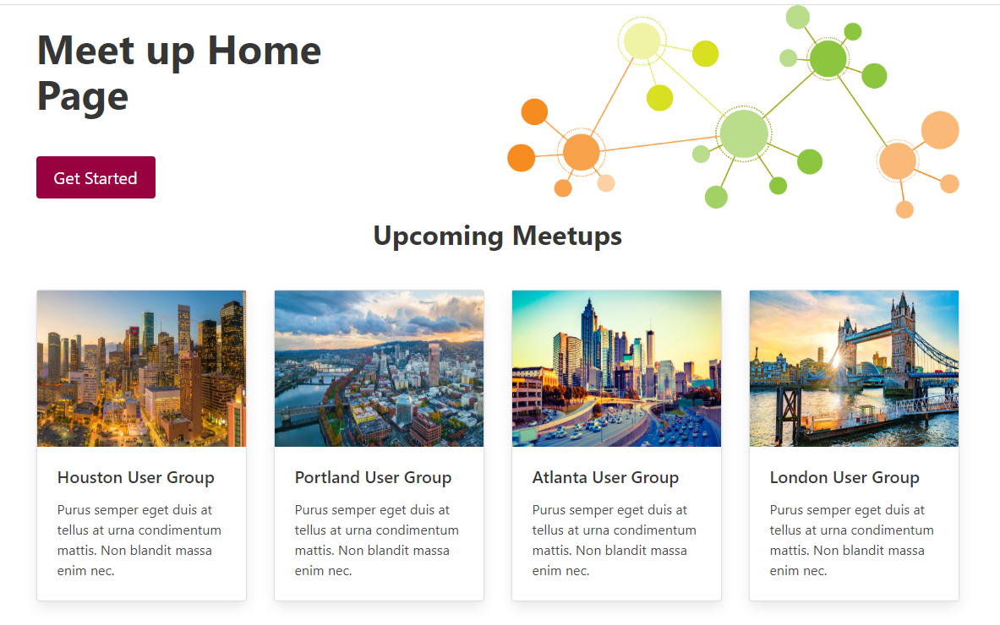
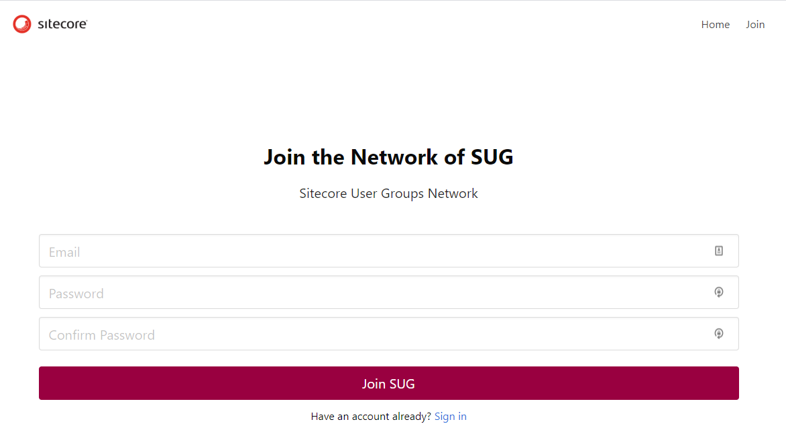
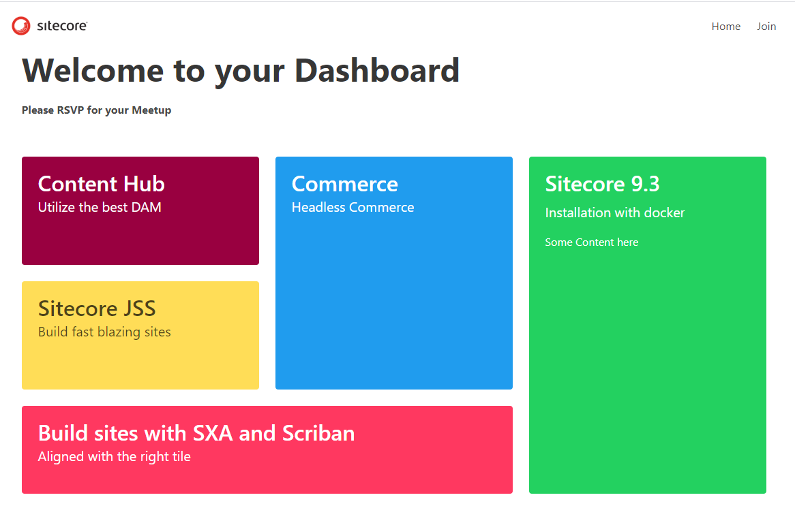

# Documentation

## Summary

**Category:** Sitecore Meetup Website
 **Team:** Sitecore Lunatics

We went with the Meetup website.  On the homepage will be an active listing of upcoming events for the community.  There will be two types of users that frequent the website.  There will be meetup organizes and then there will be those that would register for an upcoming event.  No matter what your role on the site, you can go to the Join section and create or login to the website.  Once authenticated, you will be presented with a dashboard that will show your upcoming events based on your account information.  Those with elevated priveledges will be able to create new SUG events.

## Pre-requisites

- Sitecore 9.3 with JavaScript Services (JSS)
- React JSS
- Authentication is handled via a Third-party identity provider
- Bulma.io

## Installation

Download the latest release package from the `Releases` tab.  Current version as of the time of this writing is `0.1.0`.  Download that locally, and then unzip.  Open
Provide detailed instructions on how to install the module, and include screenshots where necessary.

1. Install Sitecore 9.3 using SIF or the provided Sitecore Docker compose file.
2. Use the release zip provided to install within Sitecore..
3. Use the Sitecore Installation wizard to install the package
4. Do a full publish to make sure everything gets published.

## Configuration

Once you've installed, you will need to define a third party authentication provider in order to manage users, and roles.

The second heavy lift of the website, is deployment, which you can learn more about in the [Usage Section](#usage).

## Usage

This is a complete website, and not a module.  Users would pull the source and deploy up to their favorite hosting provider.  Your hosting solution should follow the JSS best practices described here (https://jss.sitecore.com/docs/techniques/devops).

## Pages

### Homepage, Meetups Landing Page

The homepage will list upcoming events in your area. As well as provide a brief introduction.

### Meetup Location Page

The Meetups location page, will display a list of upcoming events across multiple regions

### Signup

The signup page, allows a user to register so that they can manage what user groups they want to RSVP to. 

### Dashboard

This is an interface that will allow you to view a list of upcoming events in your specific region.  It will allow you to RSVP in a specific event.

## Video

We have uploaded a video that highlights the capabilities of this module:

[Team Sitecore Lunatics Video](https://youtu.be/rtahxLN4-tA)

## TL;DR

If you didn't read the above, or you have questions reach out to the team:

- Tony Mamedbekov ([@tmamedbekov](https://twitter.com/tmamedbekov))
- Dylan Young ([@sitecore_master](https://twitter.com/sitecore_master))
